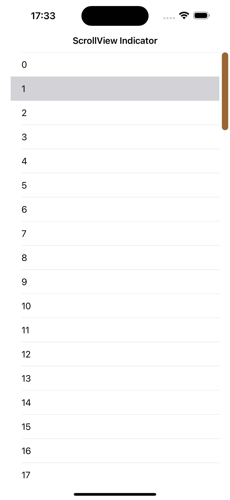

# CLCScrollViewIndicator

[](https://travis-ci.org/ClockLoveCoding/CLCScrollViewIndicator)
[](https://cocoapods.org/pods/CLCScrollViewIndicator)
[](https://cocoapods.org/pods/CLCScrollViewIndicator)
[](https://cocoapods.org/pods/CLCScrollViewIndicator)

CLCScrollViewIndicator is a custom scrollView Indicator which can change the appearance and realize.

## Example

To run the example project, clone the repo, and run `pod install` from the Example directory first.



## Installation

CLCScrollViewIndicator is available through [CocoaPods](https://cocoapods.org). To install
it, simply add the following line to your Podfile:

```ruby
pod 'CLCScrollViewIndicator'
```

## Author

ClockLoveCoding

## License

CLCScrollViewIndicator is available under the MIT license. See the LICENSE file for more info.
